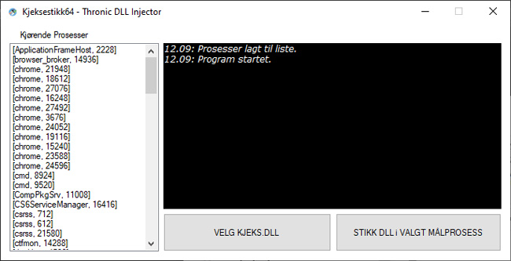
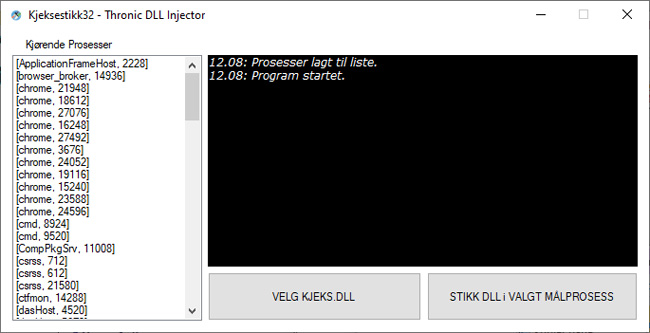

## Kjeksestikk - A basic DLL injector  

Et eldre prosjekt fra 2019 jeg hadde liggende og legger ut i tilfelle det er av interesse for noen. Opprinnelig informasjon på engelsk følger.  
***

Kjeksestikk is a basic (CreateRemoteThread/LoadLibrary w/allocated path buffer) DLL injector.  
Kjeksestikk was created during the experimentation and learning of manipulating processes internally.  

  

  

**There are a few components:**  
1. Kjeksestikk - the C# UI.  
2. Injiserer - The P/Invoked back end for the UI.  
3. dllinjecttest - A test dll for injection.  
4. Dummy1ForIda - A test target for the dll.  

**Video demo**  
https://youtu.be/cO-wlIfNl4s?si=cDWW84c8hcXHPhOC  